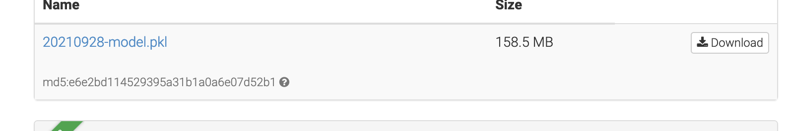
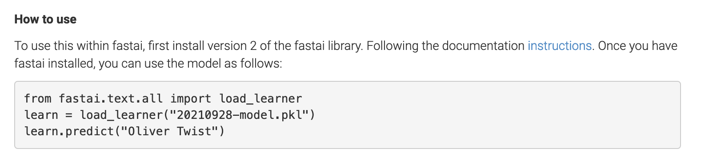
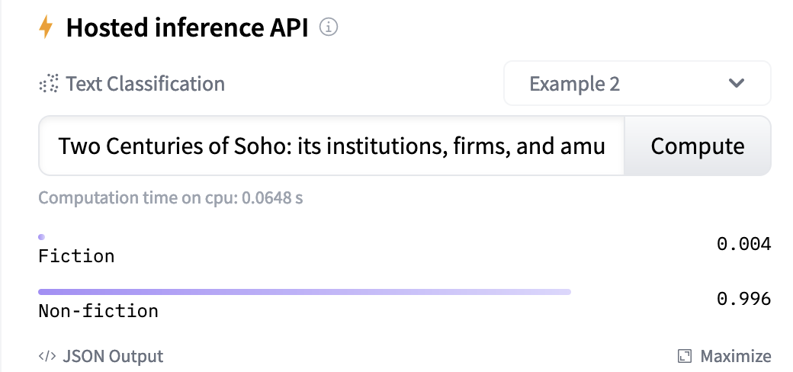
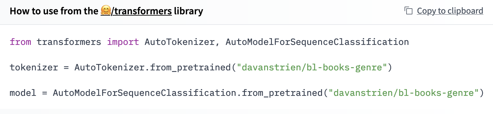
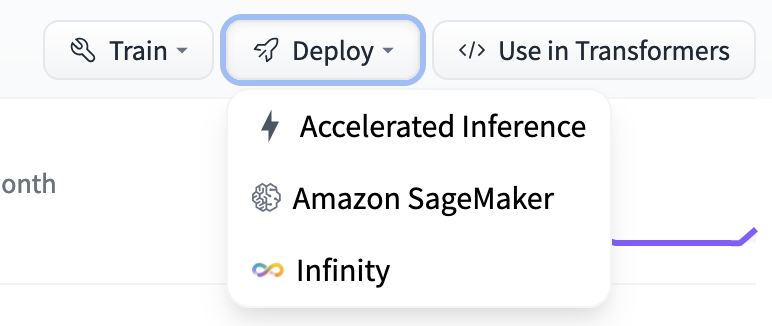
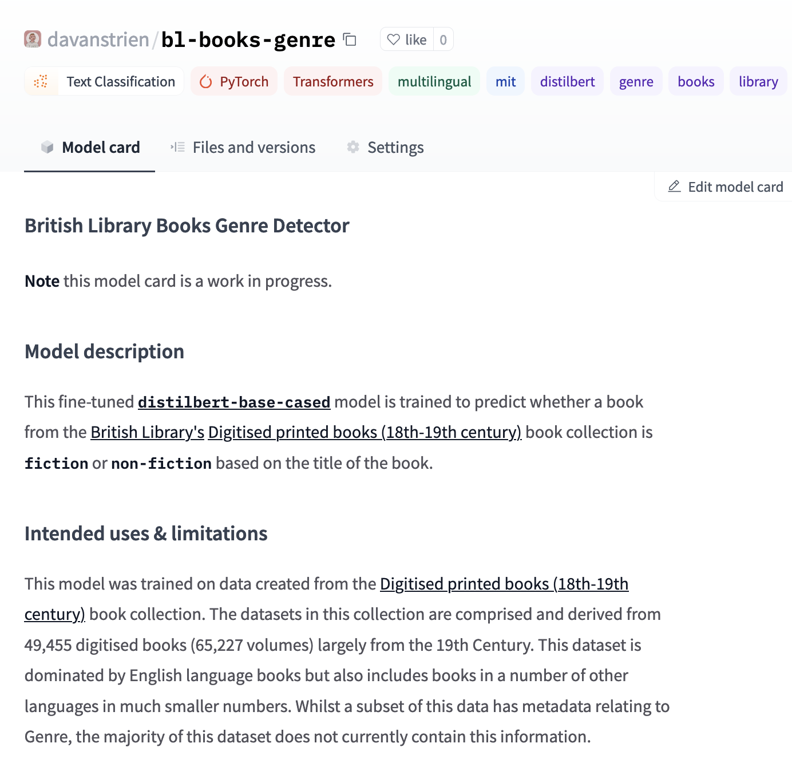
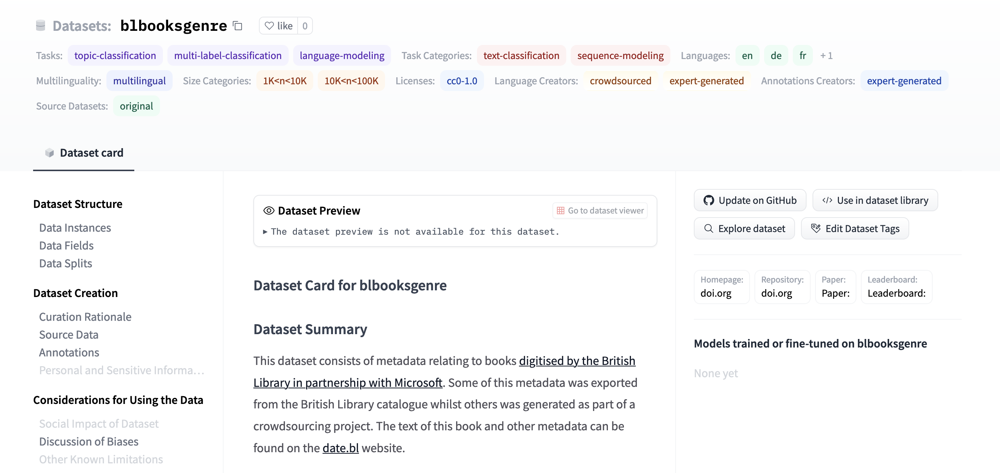
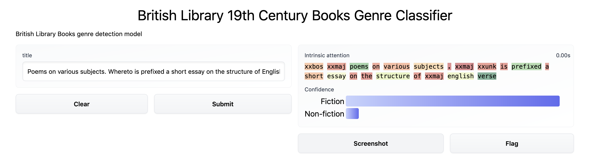

# Sharing our work

We have now gone through the process of creating a model that performs fairly well for our task. Although we originally created this model for our own needs, it is possible that others might benefit from our work. It therefore makes sense to share it so others can adapt or build on the model. Another reason we might want to share the things we used to build our model is so that others can interrogate our approach and model.

## Sharing our model?

We'll start by discussing how we can share our model. What does it mean to share our model? When we train our model we essentially have a few different components that fit together:

- the architecture for our model, the number of layers etc.
- the model weights (trainable and non-trainable parameters)
- the training process, hyperparameters, learning rate etc.

When we share the artefact of our work we mainly care about the first two components. For someone else to be able use our model we'll usually need to think about how to share the first two components. In our work so far we've mainly used 'of the shelf' model architectures, namely [`AWD_LSTM`](https://docs.fast.ai/text.models.awdlstm.html) for our `fastai` model and [`DistilBERT`](https://huggingface.co/transformers/model_doc/distilbert.html) for our huggingface model. This means we could in theory just point people to those architectures and share the model weights with them. In practice most machine learning frameworks have some way of making the process of saving, and loading, all the necessary components of our model in an easier way. We won't dig too much into the specifics of this here since it becomes too framework specific. Instead we'll focus on more general considerations around the process of sharing a model.

### Where to share?

There are various options for *where* we can share our model with other people. The criteria for where to share your model will depend on a number of factors including the type of model you are sharing, the context in which it was developed and requirements your institutions (or funder) might have.

For this work we used two (sort of three) places we share our data:

- [Zenodo](https://zenodo.org/)
- [British Library repository](https://bl.iro.bl.uk/)
- [Hugging Face Hub](   https://huggingface.co/models)

The first of these two are research repositories, one 'generic' and one for British Library staff. These repositories are a common way of sharing research outputs including papers, code, and datasets. Whilst some repositories have a particular focus many will accept machine learning models. Some advantages these repositories can offer for sharing your model include:

- being able to intergrate into an existing ecosystem alongside other outputs you produce
- getting a persistent identifier for your model (such as a [DOI](https://doi.org/))
- long-term preservation of your model (most research repositories have fairly ambitious preservation timelines i.e. 10+ years)

Putting your model into one of these repositories offers a good option for making the model available long term. One of the models we developed (the first fastai model) can be found on Zenodo.

This badge 
takes us to the landing page for the model. We can also see that we have a file we can now download which contains our model:

This is a good start on making it possible to access your model but there are other steps we may consider to make it easier for people to *use* your model.

#### 🤗 model hub

We have already touched on the 🤗 model hub in a previous [chapter](04b_transformer.ipynb). Whilst putting our model on Zenodo or another research repository makes your model available people may still not know how to use your model. For the model we built we tried to make this a bit easier by giving some instructions:

Whilst this is a useful start it still requires some knowledge from the user about how to install the `fastai` library and set up an environment for running the code. If our goal with sharing our models, particularly to a broader audience of GLAM staff this isn't ideal. One other limitation with this approach is that people have no way of 'trying before the buy' i.e. playing around with the model to get an intuition  for how it works, and importantly, what limitations it has. For example, if someone was considering using or adapting this genre detection model, they might want to try testing it with their own book titles to see if it makes sensible predictions. We could address this in other ways as we'll discuss below in the section {ref}`content:references:demo-apps`.  However, being able to give people an easy way to *use* your model is where the 🤗 model hub shines.

For a start, we can see that the huggingface model we created can now be tried directly in the hub:

This makes it easier for someone to quickly try a few inputs to see if they get sensible answers back.

We also get a few other benefits from sharing our model in the 🤗 hub:

This is similar to what we manually created in our Zenodo example but we got this example code for 'free' since the hub knows what our model is i.e. that it is a transformer model. If it was trained with another framework supported by the hub such as [Spacy](https://spacy.io/), we would get different example code here.

One final benefit we'll touch on is the ability to access the models via an API:

This allows anyone (with some usage limits) to call an API to make predictions using our model. If you are trying to use a model in a production setting this could be very useful and remove some of the complexity of hosting the model yourself. It also means that someone could use our model with another programming language. Whilst Python is a fairly popular language in the GLAM sector there are also many institution's making use of Java, Ruby etc. Having an API to use means people without Python, or machine learning knowledge, can more easily use our models. There are obviously some potential downsides to this. When we call an API to tell us the current temperature in Paris, France, we sort of take for granted that the result is probably right. In our case though we might want people to be a little bit more sceptical of our API. We'll touch on possible mitigation's to this concern shortly.

#### Possible limitations

There are a few concerns you might have about putting models in the 🤗 hub, particularly from a GLAM context. Two major possible concerns include:

- long-term sustainability
- persistent identifiers

Probably the most pragmatic way to alleviate some of these fears is to follow the `LOCKSS` (Lots of Copies Keep Stuff Safe) principle and keep a copy of your model in a research repository. This could be automated or done manually depending on your particular needs. It is also possible that both of these areas will be addressed further by the platform.

## Model cards

We've discussed some of the necessary steps to sharing our model. However, if we stop at the point of sharing model files/weights we aren't being super helpful. What are the model weights? Essentially a bunch of numbers. If this is all we share without any context it's hard for any one else who hasn't been involved in the process of developing the model to know:

- what the model does?
- how to use it?
- what the possible labels are?
- is the model any good?
- when does the model not work well?
- what training data was used?

This is a non-exhaustive list of things people may want to know. This information becomes even more important if our model is going to be used to make decisions or inform decisions that impact humans. In our particular case we are predicting the genre of 19th-Century books. This is maybe not as high stakes as a model approving or rejecting insurance claims but it may still have an impact on people depending on how the model is used. For example, if the model is used to help with discovery, books which are mislabelled might be less discoverable. If the mistakes are model are not random i.e. they are systematic in some way, this might mean some types of books be made less discoverable. For example, we have been concerned throughout this process with the impact of language on our model. If our model sucks at predicting non English book titles it is important people know this.

This is what a model card aims to help address. The Model Cards for Model Reporting {cite:p}`mitchell2019` paper offers a framework for approaching this task. The paper gives some structure to addressing things people may want, and more likely *should* know, about our model. We have attempted to try and follow this structure in documenting our models. Whether we have done a good job is open to debate, however, we think that *attempting* to complete these model cards when sharing models.

## Sharing our data

Similar to how we shared our model using the 🤗 hub we can also share our training data on this hub. There are some nice advantages to this:

- we make our data discoverable in a ecosystem where many people are looking for datasets already
- we can give access to our dataset in one line of code. This can also help 'abstract' any nuances about pre-processing etc for the data.
- we are strongly encouraged to properly document our dataset (more on this below)

This dataset can be found is available as [blbooksgenre](https://huggingface.co/datasets/blbooksgenre) on the 🤗 hub.

### Datasheets for datasets

We've agonised about our data a fair bit in the development of this model. It seems sensible then that we should also share the data we used to train our model. Whilst our training data is a bit more directly interpretable in comparison to our model (which in some sense is a bunch of numbers), there are still many things that our data won't convey directly. For this reason it is important to also document our data. *Datasheets for Datasets* {cite:p}`gebru2020datasheets` provides a framework to help us do this documentation.

Completing this datasheet isn't always easy, especially when the data you are working with has a complex provenance, as is often the case with GLAM collections. However, shifting from documenting individual items at the catalogue level, to documenting collections at scale will require different approaches and *Datasheets for Datasets* offers a useful starting point for tackling this challenge.

This video provides more background to the motivations and aims of datasheets.

<iframe src="https://player.vimeo.com/video/639588440?h=a28bc8a741" style="position:absolute;top:0;left:0;width:100%;height:100%;" frameborder="0" allow="autoplay; fullscreen; picture-in-picture" allowfullscreen></iframe>

<a href="https://vimeo.com/639588440">Datasheets for Datasets</a> from <a href="https://vimeo.com/user4730653">CACM</a> on <a href="https://vimeo.com">Vimeo</a>.

#### GLAM specific considerations?

We have shown some *possible* approaches to sharing our work. Most of this has been fairly generic i.e. we didn't focus a huge amount on anything GLAM specific. Many of the things we said about making things more accessible would be relevant to many domains which want to make use of machine learning i.e. a biologist wanting to use a machine learning model might have similar challenges to a librarian. However, there may be some things which are GLAM specific particularly around GLAM data.

We don't offer much in the way of suggestions here. Model cards and datasheets both offer a very useful foundation. It probably makes sense to build on this work and go through the work of trying to document GLAM collections for use in machine learning. Working through this process will hopefully begin to reveal some common needs or extensions that might be required for GLAM data. i.e. there may need to be more background on selection biases for digitised collections, or an explanation of metadata standards which might be familiar to GLAM staff but not to people working in NLP.

This is hopefully an area that will continue to develop as part of initiatives like [ai4lam](https://sites.google.com/view/ai4lam).

(content:references:demo-apps)=
## Demo apps

One other way in which we can make our models more useful for others is to create an application which allows people to use the model without having to go through a lot of steps to get the model setup. This might sound like a lot of work but there are a number of tools that make this easier to do. Two of these are [Gradio](https://www.gradio.app/) and [Streamlit](https://streamlit.io/).

We created a simple demo app for the fastai model we trained in an earlier section: . This demo app is primarily intended to offer some ways of exploring the model.

### More to come...

There are other potential demo apps related to this work which we might create after the release of this 'book'.
